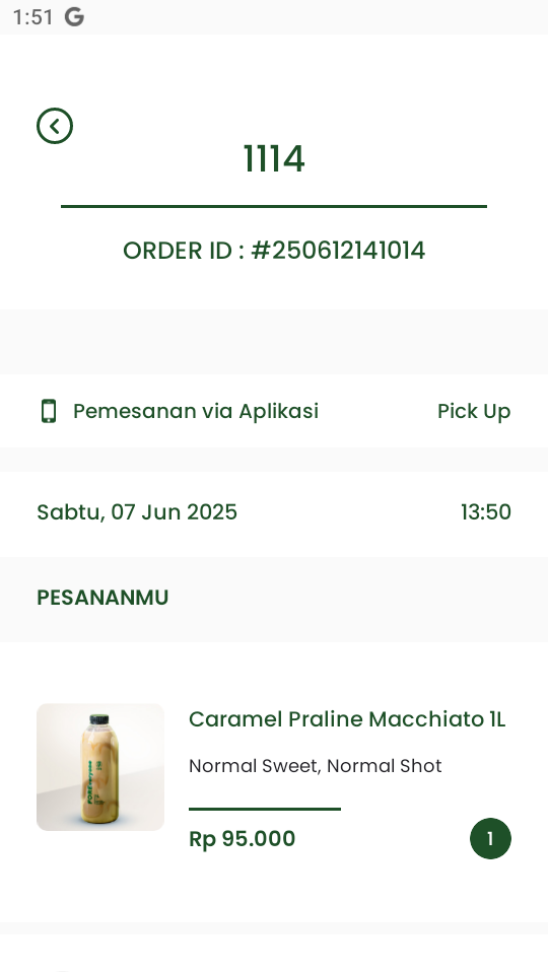

# 💧 WATERMARK-MIWEDIGITALSTORE

**WATERMARK-MIWEDIGITALSTORE adalah solusi sederhana namun efektif untuk menambahkan watermark secara otomatis pada file gambar (.png / .jpg) berdasarkan data orderan.
**Program ini dibuat menggunakan Python dan dirancang untuk memudahkan proses branding atau pelabelan gambar secara batch.

---

## 🚀 Fitur Utama

- ✅ Tambah watermark otomatis berdasarkan nama store, contoh ( MIWE DIGITAL STORE )
- 🖼️ Dukungan untuk format gambar PNG dan JPG
- 🔐 Lindungi pratinjau desain agar tidak dicuri atau disalahgunakan
- 📁 Bisa digunakan untuk memproses gambar satuan atau banyak sekaligus
- ⚙️ Konfigurasi teks dan posisi watermark yang fleksibel

---

## 🛠️ Cara Kerja

1. Anda upload gambar hasil desain (PNG/JPG).
2. Sistem membaca data order (bisa berupa nama customer, ID, atau info lainnya).
3. Watermark disisipkan secara otomatis pada gambar.
4. Gambar siap dikirim sebagai **preview** atau **sample aman** ke customer/store.

---

## 📸 Contoh Hasil

| Sebelum | Sesudah |
|--------|---------|
|  |  |

---

## 🔧 Instalasi

```bash
git clone https://github.com/username/WATERMARK-MIWEDIGITALSTORE.git
cd WATERMARK-MIWEDIGITALSTORE
cd watermark
python wm.py
